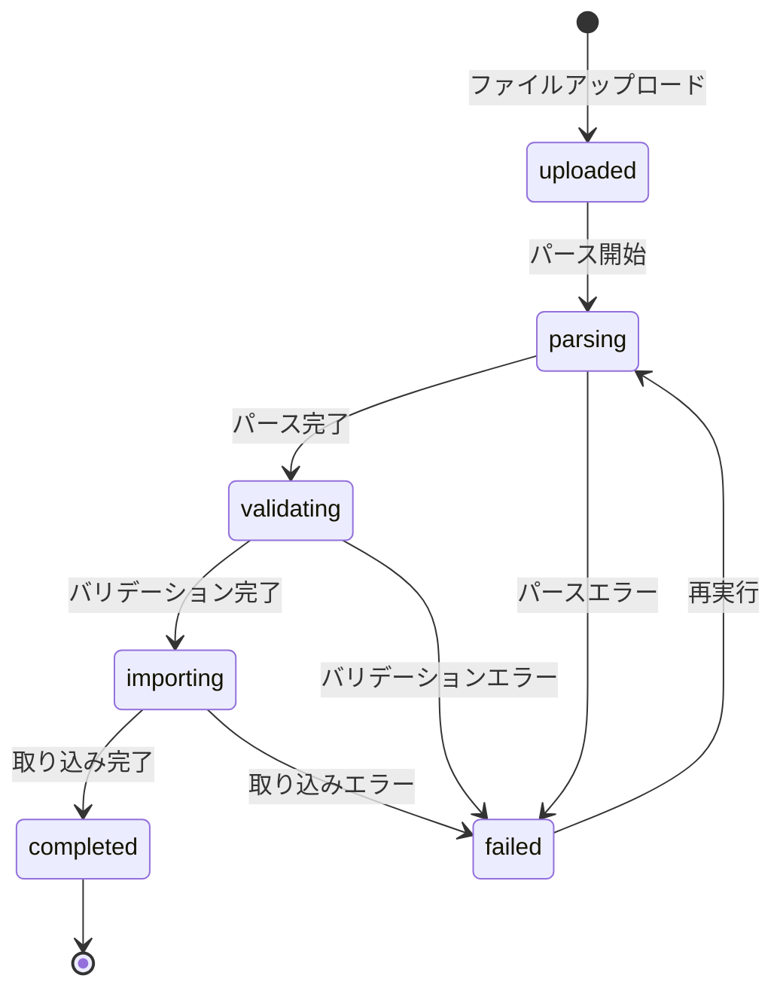

# 設計書: ファイルアップロード・パース・プレビュー

## 概要

Importサブシステムの入口機能。CSV/xlsxファイルのアップロード、パース処理（openpyxl + pandas）、プレビュー表示を提供する。
Import_Jobエンティティの定義とステータス遷移ロジック、ColumnMappingエンティティの定義もこのspecで行う。

依存: shared-foundation（FastAPI基盤、SQLAlchemy、ドメイン例外、AuditService）

## アーキテクチャ

### バックエンド追加コンポーネント

```
server/app/
  domain/entities/
    import_job.py            ImportJob dataclass, JobStatus enum, ステータス遷移ロジック
    column_mapping.py        ColumnMapping dataclass
    import_error.py          ImportError dataclass, ErrorType enum
  domain/repositories/
    i_job_repository.py      IJobRepository ABC
    i_mapping_repository.py  IMappingRepository ABC
    i_error_repository.py    IErrorRepository ABC
  domain/interfaces/
    i_file_parser.py         IFileParser ABC
  infrastructure/database/
    models.py                ImportJobModel, ColumnMappingModel, ImportErrorModel 追加
  infrastructure/repositories/
    job_repository.py        JobRepository具象
  infrastructure/parser/
    base_parser.py           パーサー基底
    csv_parser.py            CsvParser（pandas）
    xlsx_parser.py           XlsxParser（openpyxl + pandas）
  application/
    import_job_service.py    ImportJobService（upload_file, parse_file, get_preview）
  presentation/jobs/
    router.py                POST /upload, POST /{id}/parse, GET /{id}/preview
    schemas.py               JobResponse, ParseResultResponse, PreviewResponse
```

### フロントエンド追加コンポーネント

```
client/app/
  entities/import-job/types.ts     ImportJob型, JobStatus enum
  entities/column/types.ts         Column型, ColumnMapping型
  entities/error/types.ts          ImportError型, ErrorType enum
  features/upload/                 useFileUpload hook, upload-file API
  widgets/upload-dropzone/         react-dropzone D&D UI
  widgets/preview-table/           TanStack Table + Virtual プレビュー
  routes/jobs.upload.tsx           アップロード画面
```

## コンポーネントとインターフェース

### バックエンド

#### domain層

**エンティティ:**
- `ImportJob`: ジョブエンティティ（id, file_name, file_path, file_size, file_type, sheet_name, header_row, status, total_rows, error_count, template_id, operator, created_at, updated_at）
  - `can_transition_to(new_status)`: ステータス遷移の妥当性検証
  - `transition_to(new_status)`: ステータス遷移実行（不正時はInvalidStatusTransitionError）
- `ColumnMapping`: 列マッピングエンティティ（id, job_id, source_column, target_column, data_type, nullable, is_unique, pattern, display_order）
- `ImportError`: エラーエンティティ（id, job_id, row_number, column_name, error_type, expected_value, actual_value, message）

**Enum:**
- `JobStatus`: uploaded / parsing / validating / importing / completed / failed
- `ErrorType`: type_error / required_error / unique_error / pattern_error / range_error / unknown_error

**許可されるステータス遷移:**
- uploaded → parsing
- parsing → validating / failed
- validating → importing / failed
- importing → completed / failed
- failed → parsing（再実行）

**リポジトリインターフェース:**

```python
class IJobRepository(ABC):
    async def create(self, job: ImportJob) -> ImportJob: ...
    async def get_by_id(self, job_id: UUID) -> ImportJob | None: ...
    async def list_jobs(self, status: str | None, page: int, per_page: int) -> tuple[list[ImportJob], int]: ...
    async def update(self, job: ImportJob) -> ImportJob: ...

class IMappingRepository(ABC):
    async def bulk_create(self, mappings: list[ColumnMapping]) -> None: ...
    async def list_by_job(self, job_id: UUID) -> list[ColumnMapping]: ...
    async def delete_by_job(self, job_id: UUID) -> None: ...

class IErrorRepository(ABC):
    async def bulk_create(self, errors: list[ImportError]) -> None: ...
    async def list_by_job(self, job_id: UUID, page: int, per_page: int,
                          column_name: str | None, error_type: str | None) -> tuple[list[ImportError], int]: ...
    async def delete_by_job(self, job_id: UUID) -> None: ...
```

**パーサーインターフェース:**

```python
class IFileParser(ABC):
    def get_sheet_names(self, file_path: str) -> list[str]: ...
    def parse(self, file_path: str, file_type: str, sheet_name: str | None,
              header_row: int) -> tuple[pd.DataFrame, list[str], int]: ...
```

#### application層

**ImportJobService（本specの範囲）:**

```python
class ImportJobService:
    def __init__(self, job_repo, mapping_repo, error_repo, template_repo,
                 audit_repo, parser, validator, staging_manager): ...

    async def upload_file(self, file: UploadFile, operator: str) -> ImportJob: ...
    async def parse_file(self, job_id: UUID, sheet_name: str | None, header_row: int) -> ParseResult: ...
    async def get_preview(self, job_id: UUID, limit: int = 50) -> PreviewData: ...
    async def get_job(self, job_id: UUID) -> ImportJob: ...
    async def list_jobs(self, status: str | None, page: int, per_page: int) -> tuple[list[ImportJob], int]: ...
```

注: ImportJobServiceは全Import操作を統合するサービスだが、本specではupload/parse/previewのみ実装する。
set_mapping/validate/run_import/retryは後続specで追加実装する。

#### presentation層

**エンドポイント:**

| メソッド | パス | 説明 |
|---------|------|------|
| POST | /api/v1/jobs/upload | ファイルアップロード・ジョブ作成 |
| POST | /api/v1/jobs/{job_id}/parse | パース実行 |
| GET | /api/v1/jobs/{job_id}/preview | プレビュー取得 |
| GET | /api/v1/jobs | ジョブ一覧 |
| GET | /api/v1/jobs/{job_id} | ジョブ詳細 |

## データモデル

### import_jobs

| フィールド | 型 | 制約 | 説明 |
|-----------|-----|------|------|
| id | UUID | PK | ジョブID |
| file_name | VARCHAR(255) | NOT NULL | アップロードファイル名 |
| file_path | VARCHAR(1024) | NOT NULL | サーバー上の保存パス |
| file_size | BIGINT | NOT NULL | ファイルサイズ（bytes） |
| file_type | VARCHAR(10) | NOT NULL, CHECK IN ('csv','xlsx') | ファイル種別 |
| sheet_name | VARCHAR(255) | NULL | 選択シート名 |
| header_row | INTEGER | NOT NULL, DEFAULT 0 | ヘッダ開始行（0-indexed） |
| status | VARCHAR(20) | NOT NULL, DEFAULT 'uploaded' | ジョブステータス |
| total_rows | INTEGER | NULL | 総行数 |
| error_count | INTEGER | NOT NULL, DEFAULT 0 | エラー件数 |
| template_id | UUID | NULL, FK→templates | テンプレートID |
| operator | VARCHAR(255) | NOT NULL | 操作者名 |
| created_at | TIMESTAMPTZ | NOT NULL | 作成日時 |
| updated_at | TIMESTAMPTZ | NOT NULL | 更新日時 |

### column_mappings

| フィールド | 型 | 制約 | 説明 |
|-----------|-----|------|------|
| id | UUID | PK | マッピングID |
| job_id | UUID | NOT NULL, FK→import_jobs CASCADE | ジョブID |
| source_column | VARCHAR(255) | NOT NULL | ソース列名 |
| target_column | VARCHAR(255) | NOT NULL | ターゲット列名 |
| data_type | VARCHAR(20) | NOT NULL | データ型 |
| nullable | BOOLEAN | NOT NULL, DEFAULT true | NULL許可 |
| is_unique | BOOLEAN | NOT NULL, DEFAULT false | 一意制約 |
| pattern | VARCHAR(512) | NULL | 正規表現パターン |
| display_order | INTEGER | NOT NULL, DEFAULT 0 | 表示順序 |

UNIQUE: (job_id, source_column), (job_id, target_column)

### import_errors

| フィールド | 型 | 制約 | 説明 |
|-----------|-----|------|------|
| id | UUID | PK | エラーID |
| job_id | UUID | NOT NULL, FK→import_jobs CASCADE | ジョブID |
| row_number | INTEGER | NOT NULL | 行番号（1-indexed） |
| column_name | VARCHAR(255) | NOT NULL | 列名 |
| error_type | VARCHAR(20) | NOT NULL | エラー種別 |
| expected_value | TEXT | NULL | 期待値 |
| actual_value | TEXT | NULL | 実際の値 |
| message | TEXT | NOT NULL | エラーメッセージ |

### ステータス遷移図



## 正確性プロパティ

### Property 1: アップロードによるジョブ作成

*For any* 有効なCSVまたはxlsxファイルと操作者名の組み合わせに対して、アップロード後に作成されるImport_Jobはステータスが「uploaded」であり、ファイル名・ファイルサイズ・ファイル種別・操作者名・作成日時を全て含む

**Validates: Requirements 1.1, 1.4**

### Property 2: 無効ファイル形式の拒否

*For any* CSV・xlsx以外のファイル拡張子に対して、アップロードは拒否されImport_Jobは作成されない

**Validates: Requirements 1.3**

### Property 3: パースメタデータの正確性

*For any* 有効なCSV/xlsxファイルに対して、パース実行後に返される列名リストはファイルの指定ヘッダ行の列と一致し、総行数はヘッダ行以降のデータ行数と一致する

**Validates: Requirements 2.1, 2.2**

### Property 4: プレビュー行数制限

*For any* パース済みファイルに対して、プレビューで返される行数はmin(実データ行数, 50)と一致する

**Validates: Requirements 3.1**

### Property 5: ステータス遷移の妥当性

*For any* Import_Jobのステータスと遷移先の組み合わせに対して、許可される遷移のみが成功し、それ以外はINVALID_STATUSエラーとなる

**Validates: Requirements 4.1, 4.2, 4.3, 4.4**

## テスト戦略

### テストフレームワーク

- バックエンド: pytest + hypothesis
- フロントエンド: vitest + @testing-library/react

### プロパティベーステスト

- ライブラリ: hypothesis（Python）
- タグ形式: **Feature: file-upload-parse, Property {number}: {property_text}**
