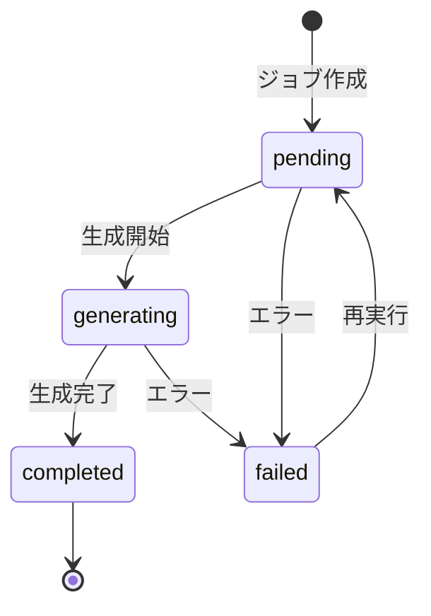

# 設計書: 帳票生成・ジョブ管理・ダウンロード

## 概要

Reportサブシステムの帳票生成・ジョブ管理機能。帳票出力ジョブの作成、データ抽出・帳票ファイル生成（PDF/Excel/CSV）、ファイルダウンロード、再実行を提供する。

依存: shared-foundation, report-template-management（ReportTemplate, ReportTemplateField, IReportTemplateRepository）

## アーキテクチャ

### バックエンド追加コンポーネント

```
server/app/
  domain/entities/
    report_job.py            ReportJob dataclass, ReportJobStatus enum, ステータス遷移ロジック
    report_output.py         ReportOutput dataclass
  domain/repositories/
    i_report_job_repository.py    IReportJobRepository ABC
    i_report_output_repository.py IReportOutputRepository ABC
  domain/interfaces/
    i_report_generator.py    IReportGenerator ABC
  infrastructure/database/
    models.py                ReportJobModel, ReportOutputModel 追加
  infrastructure/repositories/
    report_job_repository.py     ReportJobRepository具象
    report_output_repository.py  ReportOutputRepository具象
  infrastructure/report_generator/
    base_generator.py        帳票生成基底クラス
    excel_generator.py       ExcelReportGenerator（openpyxl）
    csv_generator.py         CsvReportGenerator（pandas）
    pdf_generator.py         PdfReportGenerator（スタブ）
    __init__.py              ReportGeneratorFactory
  infrastructure/
    filter_builder.py        FilterConditionsBuilder
  application/
    report_job_service.py    ReportJobService
  presentation/report_jobs/
    router.py                帳票出力ジョブ エンドポイント
    schemas.py               リクエスト/レスポンススキーマ
```

### フロントエンド追加コンポーネント

```
client/app/
  entities/report-job/types.ts       ReportJob型, ReportJobStatus enum
  entities/report-output/types.ts    ReportOutput型
  features/report-job/               useReportJobPolling/List hook, create/fetch/retry/download API
  widgets/report-job-table/          帳票出力ジョブ一覧テーブル
  widgets/report-condition-form/     帳票出力条件指定フォーム
  widgets/report-download-button/    帳票ファイルダウンロードボタン
  widgets/job-status-badge/          ステータスバッジ（Import/Report共用）
  routes/report-jobs.tsx             帳票出力ジョブ一覧画面
  routes/report-jobs.new.tsx         帳票出力ジョブ作成画面
  routes/report-jobs.$jobId.tsx      帳票出力ジョブ詳細・ダウンロード画面
```

## コンポーネントとインターフェース

### バックエンド

#### domain層

**エンティティ:**

```python
@dataclass
class ReportJob:
    id: UUID
    report_template_id: UUID
    status: ReportJobStatus
    output_format: str
    filter_conditions: dict | None
    row_count: int | None
    requested_by: str
    error_message: str | None
    started_at: datetime | None
    completed_at: datetime | None
    created_at: datetime
    updated_at: datetime

@dataclass
class ReportOutput:
    id: UUID
    report_job_id: UUID
    file_name: str
    file_path: str
    mime_type: str
    file_size: int
    checksum: str          # SHA-256
    created_at: datetime
```

**Enum:**

```python
class ReportJobStatus(str, Enum):
    PENDING = "pending"
    GENERATING = "generating"
    COMPLETED = "completed"
    FAILED = "failed"
```

**ステータス遷移:**
- pending → generating / failed
- generating → completed / failed
- failed → pending（再実行）
- completed → （遷移なし）

**リポジトリインターフェース:**

```python
class IReportJobRepository(ABC):
    async def create(self, job: ReportJob) -> ReportJob: ...
    async def get_by_id(self, job_id: UUID) -> ReportJob | None: ...
    async def list_jobs(self, status: str | None, template_id: UUID | None,
                        page: int, per_page: int) -> tuple[list[ReportJob], int]: ...
    async def update(self, job: ReportJob) -> ReportJob: ...
    async def exists_by_template(self, template_id: UUID) -> bool: ...

class IReportOutputRepository(ABC):
    async def create(self, output: ReportOutput) -> ReportOutput: ...
    async def get_latest_by_job(self, job_id: UUID) -> ReportOutput | None: ...
```

**帳票生成インターフェース:**

```python
class IReportGenerator(ABC):
    def generate(self, data: pd.DataFrame, template: ReportTemplate,
                 fields: list[ReportTemplateField], output_format: str,
                 output_dir: str) -> ReportOutput: ...
```

#### infrastructure層

**帳票生成器:**
- `ExcelReportGenerator`: openpyxlによるxlsx生成。Fieldのlabel→ヘッダ、width→列幅、format_type→セル書式
- `CsvReportGenerator`: pandas to_csvによるCSV生成。Fieldのlabel→ヘッダ、display_order→列順
- `PdfReportGenerator`: PDF生成スタブ（MVP時に選定）
- `ReportGeneratorFactory`: output_formatに応じた生成器を返すファクトリ

**FilterConditionsBuilder:**
- filter_conditions JSONBからSQLAlchemyクエリを構築
- 対応演算子: eq, neq, gt, gte, lt, lte, in, like
- sort条件: field + direction (asc/desc)

#### application層

**ReportJobService:**

```python
class ReportJobService:
    def __init__(self, job_repo, output_repo, template_repo, audit_repo,
                 report_generator, session_factory): ...

    async def create_job(self, template_id, output_format, filter_conditions, requested_by) -> ReportJob: ...
    async def generate(self, job_id) -> ReportJob: ...
    async def get_job(self, job_id) -> ReportJob: ...
    async def list_jobs(self, status, template_id, page, per_page) -> tuple[list[ReportJob], int]: ...
    async def retry(self, job_id) -> ReportJob: ...
    async def get_output(self, job_id) -> tuple[ReportOutput, str]: ...
```

#### presentation層

**エンドポイント:**

| メソッド | パス | 説明 |
|---------|------|------|
| POST | /api/v1/report-jobs | ジョブ作成 |
| GET | /api/v1/report-jobs | ジョブ一覧 |
| GET | /api/v1/report-jobs/{job_id} | ジョブ詳細 |
| GET | /api/v1/report-jobs/{job_id}/download | ファイルダウンロード |
| POST | /api/v1/report-jobs/{job_id}/retry | 再実行 |

## データモデル

### report_jobs

| フィールド | 型 | 制約 | 説明 |
|-----------|-----|------|------|
| id | UUID | PK | ジョブID |
| report_template_id | UUID | NOT NULL, FK→report_templates | テンプレートID |
| status | VARCHAR(20) | NOT NULL, DEFAULT 'pending' | ステータス |
| output_format | VARCHAR(10) | NOT NULL | 出力形式 |
| filter_conditions | JSONB | NULL | フィルタ・ソート条件 |
| row_count | INTEGER | NULL | 出力行数 |
| requested_by | VARCHAR(255) | NOT NULL | リクエスト者名 |
| error_message | TEXT | NULL | エラーメッセージ |
| started_at | TIMESTAMPTZ | NULL | 生成開始日時 |
| completed_at | TIMESTAMPTZ | NULL | 生成完了日時 |
| created_at | TIMESTAMPTZ | NOT NULL | 作成日時 |
| updated_at | TIMESTAMPTZ | NOT NULL | 更新日時 |

### report_outputs

| フィールド | 型 | 制約 | 説明 |
|-----------|-----|------|------|
| id | UUID | PK | 出力ID |
| report_job_id | UUID | NOT NULL, FK→report_jobs CASCADE | ジョブID |
| file_name | VARCHAR(255) | NOT NULL | ファイル名 |
| file_path | VARCHAR(1024) | NOT NULL | 保存パス |
| mime_type | VARCHAR(100) | NOT NULL | MIMEタイプ |
| file_size | BIGINT | NOT NULL | ファイルサイズ |
| checksum | VARCHAR(64) | NOT NULL | SHA-256チェックサム |
| created_at | TIMESTAMPTZ | NOT NULL | 生成日時 |

### ステータス遷移図



## 正確性プロパティ

### Property 1: 帳票出力ジョブの作成

*For any* 有効なテンプレートID・出力形式・フィルタ条件・リクエスト者名の組み合わせに対して、作成されるReport_Jobはステータスが「pending」であり、指定された全パラメータを含む

**Validates: Requirements 1.1**

### Property 2: Filter_Conditionsによるデータ抽出

*For any* Filter_Conditions（eq/neq/gt/gte/lt/lte/in/like演算子）とデータセットの組み合わせに対して、抽出結果の全行はフィルタ条件を満たし、フィルタ条件を満たす全行が結果に含まれる

**Validates: Requirements 1.3**

### Property 3: Reportステータス遷移の妥当性

*For any* Report_Jobのステータスと遷移先の組み合わせに対して、許可される遷移のみが成功し、それ以外はInvalidStatusTransitionErrorとなる

**Validates: Requirements 3.1, 3.2, 3.3, 3.4**

### Property 4: 帳票生成の出力形式別正確性

*For any* 有効なデータセットとReport_Templateに対して、Excel形式ではFieldのlabelがヘッダ行に含まれるxlsxファイルが生成され、CSV形式ではフィールドラベルが表示順に並んだCSVファイルが生成される

**Validates: Requirements 2.3, 2.4**

### Property 5: 帳票生成完了時のReport_Output作成

*For any* 正常に完了した帳票生成に対して、Report_Outputが作成されファイルメタデータを含み、Report_Jobのステータスは「completed」である

**Validates: Requirements 2.5**

### Property 6: 帳票ダウンロードの正確性

*For any* ステータスが「completed」のReport_Jobに対して、ダウンロードレスポンスは最新のReport_Outputのファイル内容を含み、正しいMIMEタイプとContent-Dispositionヘッダが設定される

**Validates: Requirements 4.1, 4.2**

### Property 7: 帳票出力ジョブ一覧のフィルタリング

*For any* 帳票出力ジョブ一覧のフィルタ条件（ステータス・テンプレートID）に対して、返される全ジョブは指定条件に一致する

**Validates: Requirements 5.1, 5.2**

### Property 8: 帳票出力再実行

*For any* ステータスが「failed」のReport_Jobに対して、再実行後にステータスは「pending」に戻り、生成完了後に新しいReport_Outputレコードが作成される

**Validates: Requirements 6.1, 6.2**

### Property 9: 全Report操作の監査ログ記録

*For any* Report_Systemの操作（create_report_job/retry_report_job/download_report）に対して、操作成功後にAudit_Logに対応するレコードが作成される

**Validates: Requirements 1.5, 4.5, 6.4**

## テスト戦略

### テストフレームワーク

- バックエンド: pytest + hypothesis
- フロントエンド: vitest + @testing-library/react

### プロパティベーステスト

- ライブラリ: hypothesis（Python）
- タグ形式: **Feature: report-generation, Property {number}: {property_text}**
